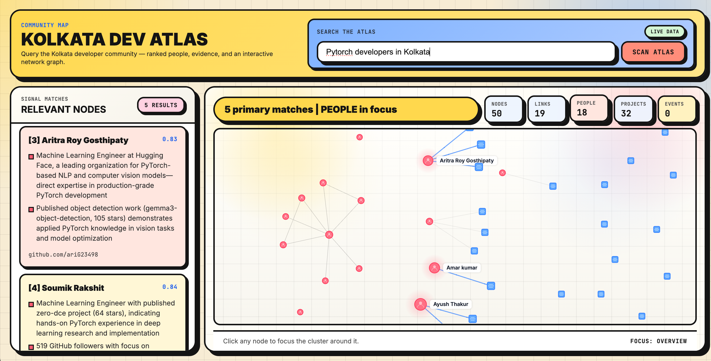

# Kolkata Dev Atlas

> A queryable, graph-backed map of the Kolkata developer community.  
> Open the page and the entire atlas renders as a force-directed graph. Ask a natural-language question and the graph re-centres on the answer, with ranked people, cited evidence, and the cluster around them — all in one shot.

---



## Table of Contents

- [What it does](#what-it-does)
- [Live demo queries](#live-demo-queries)
- [Architecture](#architecture)
- [Tech stack](#tech-stack)
- [Repository layout](#repository-layout)
- [Prerequisites](#prerequisites)
- [Installation](#installation)
- [Environment variables](#environment-variables)
- [Building the data artifacts](#building-the-data-artifacts)
  - [Step 1 — Ingest (optional, run to refresh data)](#step-1--ingest-optional-run-to-refresh-data)
  - [Step 2 — Build index (required)](#step-2--build-index-required)
- [Running the server](#running-the-server)
- [API reference](#api-reference)
  - [GET /health](#get-health)
  - [POST /query](#post-query)
  - [GET /graph](#get-graph)
- [Frontend](#frontend)
- [Testing](#testing)
  - [Test structure](#test-structure)
  - [Running tests](#running-tests)
  - [Smoke tests](#smoke-tests)
- [Configuration](#configuration)
  - [Kill switch](#kill-switch)
  - [Frontend request timeouts](#frontend-request-timeouts)
  - [Subgraph and full-graph caps](#subgraph-and-full-graph-caps)
  - [Kolkata signal gate](#kolkata-signal-gate)
- [Data model](#data-model)
  - [people.jsonl](#peoplejsonl)
  - [repos.jsonl](#reposjsonl)
  - [edges.jsonl](#edgesjsonl)
- [Contributing](#contributing)
- [License](#license)

---

## What it does

Kolkata Dev Atlas answers questions like:

- *"Who works on LangGraph in Kolkata?"*
- *"Who mentors junior ML engineers?"*
- *"Show me the Jadavpur developer cluster"*

**Landing view (no query).** Open `/` and the entire Kolkata atlas renders as a force-directed graph: top-N people by centrality, repos owned by those people, events, and orgs — all interconnected. This is the no-query experience, a community map you can pan and click into. Press **Escape** at any time (or submit an empty query) to return to this overview.

**Query view.** Submitting a query switches the graph into focused mode. For each query it returns:

1. **Ranked people results** — name, GitHub URL, relevance score, and 2-3 evidence bullets
2. **2-hop subgraph** seeded from the top-15 retrieval hits — capped at 180 nodes, prioritising bridge nodes (events, orgs, shared repos) so the rendered graph is interconnected rather than five disconnected stars
3. **Interactive force graph** in the browser that re-clusters around the query's strongest signal

**Kolkata-only by construction.** Every person in the graph carries a `kolkata_signal` (`github_location`, `event_attended`, `org_member`, or `manual_curation`). The build step rejects accounts that fail this gate — so a Kolkata developer who happens to follow a global account on GitHub does not pull that account into the atlas. The same gate is applied inside the retriever, so even a literal-keyword search cannot resurrect filtered-out records.

**Hybrid retrieval.** Pure vector search against `all-MiniLM-L6-v2` gets dominated by the most frequent term in a query and buries rare technical tokens. The retriever blends vector similarity with literal keyword match, then graph centrality, so a query like *"langgraph kolkata"* surfaces the Kolkata developers who actually ship LangGraph rather than just the most-followed Kolkata developers in general.

**Resilient pipeline.** If the LLM-powered Parser or Ranker agents fail, the service automatically falls back to a 2-agent baseline (Retriever + Composer). If the Composer fails too, raw evidence is returned. The graph is always renderable.

---

## Live demo queries

| Query | What it highlights |
|---|---|
| Who works on LangGraph in Kolkata? | LLM/agent tooling cluster |
| Who mentors ML juniors in Kolkata? | Mentor/educator network |
| Show Jadavpur developer network | University alumni cluster |

These are the recommended smoke-test queries for the live backend. If the backend is unavailable, the UI shows the failure instead of masking it with canned demo results.

---

## Architecture

```
Browser (force-graph)
        │
        │ GET /            GET /*.js  GET /*.css
        │ GET /graph       — landing view, full atlas, no LLM
        │ POST /query      — focused view, 4-agent pipeline
        ▼
┌──────────────────────────────────────────────┐
│              FastAPI  (atlas/main.py)         │
│  CORS · static file routes · lifespan init   │
└───────────────────┬──────────────────────────┘
                    │
                    ▼
┌──────────────────────────────────────────────┐
│           Query Pipeline  (atlas/agents.py)   │
│                                               │
│  [1] Parser Agent  ──► extract skills / role  │
│         │                  (claude-haiku)      │
│         ▼                                     │
│  [2] Retriever Step ──► vector + graph search │
│         │                  (no LLM)           │
│         ▼                                     │
│  [3] Ranker Agent  ──► re-rank top-k          │
│         │                  (claude-haiku)      │
│         ▼                                     │
│  [4] Composer Agent ──► write evidence        │
│                            (claude-haiku)      │
│                                               │
│   ⚡ Fallback: Retriever + Composer only      │
└───────────────┬──────────────────────────────┘
                │
                ▼
┌──────────────────────────────────────────────┐
│           Retriever  (atlas/retrieval.py)     │
│                                               │
│  Hybrid retrieval:                            │
│   - ChromaDB (cosine)  → vector similarity    │
│   - Literal keyword match → rare-token boost  │
│   - PageRank centrality → 30% blend           │
│                                               │
│  Subgraph (2-hop, max 180):                   │
│   - shared-with-many-seeds beats centrality   │
│   - bridge nodes (events, orgs) always kept   │
│                                               │
│  full_graph(max=350) for /graph:              │
│   - top persons + their repos + all bridges   │
│   - every visible repo has a visible owner    │
│                                               │
│  Kolkata gate: self._people / _search_docs    │
│  filtered to graph members only — no leakage. │
└───────────────┬──────────────────────────────┘
                │
                ▼
┌──────────────────────────────────────────────┐
│         Data Layer  (data/)                   │
│  people.jsonl · repos.jsonl · edges.jsonl     │
│  kolkata_seeds.txt (allowlist, optional)      │
│  denylist.txt        (blocklist, optional)    │
│  graph.pkl (NetworkX)  ·  chroma/ (ChromaDB)  │
└──────────────────────────────────────────────┘
```

**Offline data pipeline (run once before serving):**

```
scripts/ingest.py       ──► data/raw/  +  data/*.jsonl
       │
       ▼  (harvester + GitHub search + network expansion + event cross-ref)
scripts/build_index.py  ──► data/graph.pkl  +  data/chroma/
   │
   │  Per-person Kolkata signal gate (rejects global drift):
   │   github_location | event_attended | org_member | manual_curation
   │  Synthesises `attended` / `member_of` edges from evidence text
   │  so people share bridge nodes instead of only their own repos.
```

---

## Tech stack

| Layer | Technology |
|---|---|
| LLM agents | Anthropic claude-haiku-4-5 via `anthropic` Python SDK |
| Backend framework | FastAPI + Uvicorn |
| Graph store | NetworkX DiGraph + PageRank (`networkx`) |
| Vector index | ChromaDB persistent (cosine space) |
| Embeddings | `all-MiniLM-L6-v2` via `sentence-transformers` |
| Data ingest | GitHub REST API via `requests`, `beautifulsoup4`, `rapidfuzz` |
| Harvester LLM | Google Gemini via `GEMINI_API_KEY` |
| Frontend | Vanilla JS, 3d-force-graph, Three.js |
| Testing | pytest, pytest-asyncio, httpx |
| Config | `python-dotenv` |

---

## Repository layout

```
Dev-Atlas/
├── atlas/                   # Backend Python package
│   ├── __init__.py
│   ├── main.py              # FastAPI app: /query, /graph, /health, lifespan
│   ├── agents.py            # 4-agent query pipeline + fallback
│   └── retrieval.py         # Retriever: hybrid retrieval, subgraph, full_graph
│
├── scripts/                 # Offline data pipeline (run before serving)
│   ├── ingest.py            # 5-pass data collector
│   ├── harvester_agent.py   # Seed harvester (slated for removal in M0)
│   └── build_index.py       # Kolkata-signal gate + edge synthesis + index
│
├── frontend/                # Static single-page UI (no build step)
│   ├── index.html
│   ├── app.js               # Search + landing-overview controller
│   ├── style.css            # Neo-brutalist design system
│   └── modules/
│       ├── api.js           # queryAtlas, fetchFullGraph
│       ├── config.js        # API_BASE, timeouts, INITIAL_GRAPH_NODES
│       ├── dom.js           # DOM refs and badge / metric setters
│       ├── graphRenderer.js # force-graph wrapper
│       ├── graphModel.js    # Subgraph → renderable model
│       ├── canvasDraw.js    # Node drawing
│       ├── results.js       # Result-card list
│       └── utils.js         # Shared helpers
│
├── data/                    # Source JSONL + generated artifacts
│   ├── people.jsonl         # Person records (ingest interchange format)
│   ├── repos.jsonl          # Repository records
│   ├── edges.jsonl          # Graph edges (maintains/follows/attended/…)
│   ├── kolkata_seeds.txt    # Optional manual allowlist (one ID per line)
│   ├── denylist.txt         # Optional permanent blocklist
│   ├── graph.pkl            # Generated — NetworkX DiGraph (gitignored)
│   └── chroma/              # Generated — ChromaDB store (gitignored)
│
├── docs/
│   └── kolkata-dev-atlas-prd.md     # Product spec
│
├── tests/
│   ├── conftest.py          # Shared fixtures (mock retriever, LLM client)
│   ├── test_retrieval.py    # Retriever, subgraph, full_graph, hybrid blend
│   ├── test_agents.py       # Agent pipeline unit + timeout tests
│   ├── test_api.py          # FastAPI /query, /graph, /health
│   ├── test_build_index.py  # Index builder + Kolkata gate tests
│   ├── test_data.py         # JSONL schema + integrity tests
│   ├── test_ingest.py       # Ingest pipeline tests
│   └── test_harvester_agent.py
│
├── .env                     # Secrets — never committed (see .gitignore)
├── pytest.ini
├── requirements.txt
└── readme.md
```

---

## Prerequisites

- **Python 3.12+**
- A `.env` file in the project root (see [Environment variables](#environment-variables))
- Internet access for the CDN scripts in the frontend (Three.js, 3d-force-graph)

---

## Installation

```bash
# 1. Clone the repository
git clone https://github.com/your-org/kolkata-dev-atlas.git
cd kolkata-dev-atlas

# 2. Create and activate a virtual environment
python -m venv .venv
source .venv/bin/activate          # Windows: .venv\Scripts\activate

# 3. Install dependencies
pip install -r requirements.txt
```

> The first run of `build_index.py` will also download the `all-MiniLM-L6-v2`
> sentence-transformer model (~90 MB). This happens automatically.

---

## Environment variables

Create a `.env` file in the project root. The file is gitignored.

```dotenv
# Required for the query pipeline (live LLM calls)
ANTHROPIC_API_KEY=sk-ant-...

# Required only if you run scripts/ingest.py to refresh community data
GH_TOKEN=ghp_...
GEMINI_API_KEY=...

# Optional overrides (defaults shown)
GRAPH_PATH=data/graph.pkl
CHROMA_PATH=data/chroma
```

| Variable | Required | Purpose |
|---|---|---|
| `ANTHROPIC_API_KEY` | Yes (server) | Powers Parser, Ranker, Composer agents |
| `GH_TOKEN` | Only for ingest | GitHub personal access token for API search |
| `GEMINI_API_KEY` | Only for ingest | Google AI Studio key for the harvester agent |
| `GRAPH_PATH` | No | Override path to `graph.pkl` |
| `CHROMA_PATH` | No | Override path to ChromaDB directory |

---

## Building the data artifacts

The backend needs `data/graph.pkl` and `data/chroma/` to start. These are generated from the JSONL source files and are **not** committed to the repository.

### Step 1 — Ingest (optional, run to refresh data)

The ingest script runs a 5-pass data collection pipeline:

| Pass | What it does |
|---|---|
| 1 | Harvester agent: Gemini-powered free-web crawl for seed candidates |
| 2 | Seed hydration + paginated GitHub search expansion (`location:Kolkata`, `location:"West Bengal"`, etc.) |
| 3 | Network expansion via seed followers/following with retained `follows` edges |
| 4 | Repo contributor graph + optional event cross-reference |
| 5 | Schema normalisation → `people.jsonl`, `repos.jsonl`, `edges.jsonl` |

```bash
python scripts/ingest.py
```

> Skip this step if the JSONL files under `data/` are already present.

### Step 2 — Build index (required)

```bash
python scripts/build_index.py
```

This script:

1. Reads `data/people.jsonl`, `data/repos.jsonl`, `data/edges.jsonl` (plus optional `data/kolkata_seeds.txt` and `data/denylist.txt`).
2. **Synthesises bridge edges** (`attended`, `member_of`) from each person's evidence text, so people connect through shared events / orgs instead of only through their own repos.
3. **Derives a `kolkata_signal`** for every person record: `github_location`, `event_attended`, `org_member`, or `manual_curation`. Records that fail the gate are **rejected** — they don't enter the graph or the vector index, even if other people in the graph follow them. This is what stops global drift (Linus Torvalds etc.) from re-entering via `follows` edges.
4. Builds a **NetworkX DiGraph** with only Kolkata-grounded persons and computes **PageRank** centrality.
5. Saves `data/graph.pkl`.
6. Encodes bios + repo descriptions of admitted people with `all-MiniLM-L6-v2`.
7. Writes a **ChromaDB** cosine collection to `data/chroma/`.

Re-run whenever you modify any JSONL source file or the allowlist/denylist. The script is idempotent — it recreates the Chroma collection and graph pickle from scratch each time.

**Expected output (truncated):**

```
Loading JSONL files...
  433 people, 4248 repos, 4435 raw edges
Synthesising event/org bridge edges from evidence...
  +32 synthesised edges -> 4467 total
Deriving kolkata_signal for every person...
  Admitted: 398 people
     396  github_location
       2  org_member
  Rejected: 35 people (no Kolkata signal)
    - torvalds
    - bradtraversy
    ...
Building NetworkX graph (Kolkata-only)...
  4343 nodes, 3989 edges
  Persons: 398  Repos: 3932  Events: 7  Orgs: 6
```

**Quick smoke-test after building:**

```bash
python -c "
from atlas.retrieval import Retriever
r = Retriever()
for result in r.query('langgraph kolkata'):
    print(result.person_id, round(result.score, 3))
"
```

---

## Running the server

```bash
uvicorn atlas.main:app --reload --port 8000
```

Open **http://localhost:8000/** in a browser. The FastAPI app serves the frontend static files from the same process, so no separate web server is needed.

The server log confirms successful startup:

```
INFO:     Started server process [...]
INFO:     Uvicorn running on http://0.0.0.0:8000
```

---

## API reference

Interactive docs are available at **http://localhost:8000/docs** (Swagger UI) and **http://localhost:8000/redoc**.

### GET /health

Returns a liveness check.

**Response `200 OK`:**

```json
{"status": "ok"}
```

---

### POST /query

Run the full 4-agent pipeline against the graph and return ranked results plus a subgraph.

**Request body:**

```json
{"q": "Who works on LangGraph in Kolkata?"}
```

| Field | Type | Required | Description |
|---|---|---|---|
| `q` | string | Yes | Natural-language search query |

**Response `200 OK`:**

```json
{
  "results": [
    {
      "id": "rishiraj",
      "name": "Rishiraj Acharya",
      "score": 0.912,
      "evidence": [
        "Maintains rishiraj/langgraph-experiments — 142 stars, covers multi-agent LangGraph workflows",
        "Speaker at GDG Cloud Kolkata DevFest 2024 on agentic RAG pipelines",
        "Active contributor to the LangChain ecosystem"
      ],
      "url": "https://github.com/rishiraj"
    }
  ],
  "subgraph": {
    "nodes": [
      {"id": "rishiraj", "label": "Rishiraj Acharya", "type": "person", "centrality": 0.031},
      {"id": "rishiraj/langgraph-experiments", "label": "rishiraj/langgraph-experiments", "type": "repo", "centrality": 0.009}
    ],
    "edges": [
      {"src": "rishiraj", "dst": "rishiraj/langgraph-experiments", "type": "maintains"}
    ]
  }
}
```

**Response fields:**

| Field | Type | Description |
|---|---|---|
| `results` | array | Ranked people, up to 5 |
| `results[].id` | string | Stable person identifier (GitHub login) |
| `results[].name` | string | Display name |
| `results[].score` | float | Blended relevance score `[0, 1]` |
| `results[].evidence` | string[] | 2–3 human-readable evidence bullets |
| `results[].url` | string | GitHub profile URL |
| `subgraph.nodes` | array | All nodes in the 2-hop ego subgraph (max 180) |
| `subgraph.edges` | array | Edges between those nodes |

**No-results response** also includes a `message` field:

```json
{
  "results": [],
  "subgraph": {"nodes": [], "edges": []},
  "message": "No results found for 'xyz'. Try a broader query."
}
```

**Error responses:**

| Code | Condition |
|---|---|
| `400 Bad Request` | Empty query string |
| `422 Unprocessable Entity` | Missing or malformed request body |
| `500 Internal Server Error` | Unexpected server-side failure |

**cURL example:**

```bash
curl -s -X POST http://localhost:8000/query \
  -H "Content-Type: application/json" \
  -d '{"q": "Who mentors junior ML engineers in Kolkata?"}' | python -m json.tool
```

---

### GET /graph

Return the entire Kolkata atlas — top-N nodes by centrality plus all bridge nodes (events, orgs) — for the no-query landing view. **No LLM calls**, so latency is sub-second once the in-memory graph is loaded.

**Query parameters:**

| Param | Type | Default | Range | Description |
|---|---|---|---|---|
| `max_nodes` | int | `350` | `[10, 1500]` | Maximum number of nodes in the returned subgraph. The selection is connectivity-aware: every visible repo has a visible owner edge. |

**Response `200 OK`:**

```json
{
  "subgraph": {
    "nodes": [
      {"id": "alice", "label": "Alice Roy", "type": "person", "centrality": 0.031},
      {"id": "alice/langgraph-demo", "label": "alice/langgraph-demo", "type": "repo", "centrality": 0.009},
      {"id": "evt_gdg_cloud_2024", "label": "GDG Cloud Kolkata DevFest 2024", "type": "event", "centrality": 0.014}
    ],
    "edges": [
      {"src": "alice", "dst": "alice/langgraph-demo", "type": "maintains"},
      {"src": "alice", "dst": "evt_gdg_cloud_2024", "type": "attended"}
    ]
  },
  "node_total": 4343,
  "edge_total": 3989
}
```

**Response fields:**

| Field | Type | Description |
|---|---|---|
| `subgraph.nodes` | array | The selected nodes (up to `max_nodes`). |
| `subgraph.edges` | array | Edges between those nodes (induced subgraph). |
| `node_total` | int | Total nodes in the underlying NetworkX graph (Kolkata-only). |
| `edge_total` | int | Total edges in the underlying graph. |

**Selection quotas (when capped):**

- 65% **persons** — top by PageRank centrality
- 30% **repos** — top by centrality, restricted to repos *owned by* a selected person, so every visible repo has a visible owner edge
- All **events** and **orgs** — there are at most a few dozen; they are the connective tissue of the rendered graph

**Error responses:**

| Code | Condition |
|---|---|
| `422 Unprocessable Entity` | `max_nodes` outside `[10, 1500]` |

**cURL example:**

```bash
curl -s "http://localhost:8000/graph?max_nodes=200" | python -m json.tool | head -40
```

---

## Frontend

The frontend is a **single-page app** — plain JavaScript, no build step, no Node.js required.

- `frontend/index.html` — app shell with topbar search, results panel, and 3-D graph canvas
- `frontend/app.js` — search handler, force-graph rendering, and live backend error states
- `frontend/style.css` — neo-brutalist design system (CSS variables, high-contrast palette)

**How it works:**

1. **On page load**, the app calls `GET /graph?max_nodes=350` and renders the **full Kolkata atlas** as a force graph — no LLM, sub-second.
2. **Submitting a query** posts to `http://localhost:8000/query` and waits up to **45 seconds** for the 4-agent LLM pipeline. The graph re-centres around the answer.
3. **Returning to overview** — pressing `Escape` (or submitting an empty query) clears the search and reloads the full-atlas view.
4. Ranked result cards render in the left panel; the interactive force graph on the right responds to clicks (focus a cluster) and supports keyboard navigation through results.
5. A status badge in the top-right corner shows whether live data is loading, active, or failed. If the backend is unreachable, the UI surfaces the failure rather than masking it with canned demo results.

The three canonical demo queries are the best quick checks for the live backend.

> **Note:** Always open the frontend via `http://localhost:8000/` rather than directly from
> disk (`file:///…`). Opening as a file causes CDN scripts to resolve against the `file:`
> protocol, which breaks the graph library.

---

## Testing

### Test structure

| File | Coverage area |
|---|---|
| `tests/test_retrieval.py` | `Retriever.query()`, `subgraph()`, `full_graph()`, `get_person()`, hybrid keyword+vector blend, centrality scoring, smoke tests against live data |
| `tests/test_agents.py` | Each agent in isolation, `run_pipeline()`, kill-switch fallback, `run_fallback()`, subgraph seed-set handling |
| `tests/test_api.py` | FastAPI `/query`, `/graph`, and `/health` contracts, response shape, validation bounds, error handling |
| `tests/test_build_index.py` | `build_graph()`, `compute_centrality()`, `build_chroma()`, strict-vs-legacy Kolkata gate, edge synthesis |
| `tests/test_data.py` | JSONL schema integrity, required fields, isolated nodes, duplicate IDs |
| `tests/test_ingest.py` | Ingest pipeline shape and idempotence |
| `tests/test_harvester_agent.py` | HarvesterAgent seed shape and deduplication |

### Running tests

```bash
# Run the full suite
pytest

# Verbose output
pytest -v

# A single file
pytest tests/test_retrieval.py -v

# Stop on first failure
pytest -x
```

Expected output (after `build_index.py` has been run):

```
179 passed in ~20s
```

The smoke tests under `TestSmokeQueries` require `data/graph.pkl` to exist; they run automatically once the index is built. One test (`test_langgraph_kolkata_top_result_is_relevant`) skips itself if the dataset contains no LangGraph-tagged people — that's a data-discovery problem, not a retrieval bug.

### Smoke tests

After running `build_index.py`, re-run the suite to exercise the full stack:

```bash
python scripts/build_index.py
pytest -v -k "smoke"
```

---

## Configuration

### Kill switch

`atlas/agents.py` contains a sprint-day kill switch at the top of the file:

```python
# atlas/agents.py
USE_FALLBACK = False   # flip to True to drop to 2-agent baseline immediately
```

Setting `USE_FALLBACK = True` skips the Parser and Ranker agents entirely and routes every query through the 2-agent baseline (Retriever + Composer). Use this if Parser or Ranker output is unstable.

### Frontend request timeouts

```javascript
// frontend/modules/config.js
export const QUERY_TIMEOUT_MS = 45000;     // POST /query — full 4-agent pipeline
export const GRAPH_TIMEOUT_MS = 8000;      // GET  /graph — pure read, no LLM
export const INITIAL_GRAPH_NODES = 350;    // landing-view node budget
```

`QUERY_TIMEOUT_MS` accommodates the full 4-agent pipeline (3 sequential LLM calls). If you're using a faster model or the 2-agent fallback, you can lower this. `GRAPH_TIMEOUT_MS` is intentionally tight — `/graph` does not call the LLM, so a stuck backend should not blank the landing page for 45 seconds.

### Subgraph and full-graph caps

```python
# atlas/retrieval.py
def subgraph(self, person_ids, hops=2, max_nodes=180): ...
def full_graph(self, max_nodes=350, include_types=None): ...
```

| Setting | Default | Notes |
|---|---|---|
| Subgraph hops | `2` | 1-hop produced disconnected stars; 2-hop traverses through shared events / orgs and gives a properly interconnected graph. |
| Subgraph cap | `180` | Force-graph handles 180 nodes comfortably. Selection prefers nodes that bridge multiple seeds. |
| `full_graph` cap | `350` | The default landing-view size. Selection is connectivity-aware — every visible repo has a visible owner. The `/graph` endpoint accepts `max_nodes` in `[10, 1500]`. |

### Kolkata signal gate

`scripts/build_index.py` rejects person records that fail the Kolkata gate. Two optional files in `data/` bias the gate:

| File | Effect |
|---|---|
| `data/kolkata_seeds.txt` | Manual allowlist. One ID per line. IDs here are admitted with `kolkata_signal = manual_curation`, even if their `location` is empty or generic. |
| `data/denylist.txt` | Permanent blocklist. One ID per line. IDs here are always rejected, even if they would otherwise pass the gate. Use for vandalism, opt-outs, or duplicates. |

Both files are gitignored if you prefer to keep curation private; commit them if you want curation to be reviewable in PRs.

---

## Data model

All source data lives in `data/*.jsonl` (one JSON object per line).

### people.jsonl

```jsonc
{
  "id": "rishiraj",                          // stable identifier, matches GitHub login
  "name": "Rishiraj Acharya",
  "bio": "Building multi-agent systems with LangGraph ...",
  "location": "Kolkata, West Bengal",
  "languages": ["Python", "TypeScript"],
  "followers": 312,
  "url": "https://github.com/rishiraj",
  "evidence": ["Speaker at GDG DevFest 2024", "LangChain contributor"],

  // Set by build_index.py — do not hand-edit. Records that fail the
  // gate (kolkata_signal stays null) are rejected at build time.
  "kolkata_signal": "github_location",       // github_location | event_attended |
                                             //   org_member | manual_curation
  "signal_evidence_url": "https://github.com/rishiraj"
}
```

`kolkata_signal` and `signal_evidence_url` are stamped onto each record by `scripts/build_index.py` after running `derive_kolkata_signal()`. They are written back into the JSONL file in-memory only — the on-disk JSONL is the ingest interchange format and may not have them yet. The gate is enforced unconditionally when the build is run with `kolkata_ids` derived from the gate.

### repos.jsonl

```jsonc
{
  "id": "rishiraj/langgraph-experiments",    // full_name = owner/repo
  "owner": "rishiraj",
  "description": "Multi-agent workflow experiments using LangGraph",
  "stars": 142,
  "language": "Python",
  "topics": ["langgraph", "agents", "rag"]
}
```

### edges.jsonl

```jsonc
{"src": "rishiraj",  "dst": "rishiraj/langgraph-experiments", "type": "maintains"}
{"src": "rishiraj",  "dst": "debjit-nag",                    "type": "follows"}
{"src": "rishiraj",  "dst": "evt_gdg_cloud_2024",            "type": "attended"}
{"src": "rishiraj",  "dst": "org_gdg_cloud_kolkata",         "type": "member_of"}
```

**Supported edge types:**

| Type | Meaning |
|---|---|
| `maintains` | Person owns / maintains a repo |
| `follows` | Person follows another person on GitHub |
| `attended` | Person attended an event |
| `member_of` | Person is a member of an organisation |
| `contributed_to` | Person contributed to a repo they don't own |

**Known event node IDs:**

| ID | Name |
|---|---|
| `evt_gdg_cloud_2024` | GDG Cloud Kolkata DevFest 2024 |
| `evt_gdg_cloud_2023` | GDG Cloud Kolkata DevFest 2023 |
| `evt_pycon_india_2023` | PyCon India 2023 |
| `evt_devfest_kolkata_2024` | Devfest Kolkata 2024 |
| `evt_bangla_python_2024` | Bangla Python Meetup 2024 |
| `evt_fossasia_2024` | FOSSASIA 2024 |
| `evt_fossasia_2023` | FOSSASIA 2023 |

**Known org node IDs:**

| ID | Name |
|---|---|
| `org_gdg_cloud_kolkata` | GDG Cloud Kolkata |
| `org_jadavpur_cs` | Jadavpur University CS Department |
| `org_iit_kgp` | IIT Kharagpur |
| `org_iiit_kalyani` | IIIT Kalyani |
| `org_iiest` | IIEST Shibpur |
| `org_women_techmakers` | Google Women Techmakers Kolkata |

---

## Contributing

1. **Keep the public contracts stable.** The interfaces that cross module boundaries are:
   - `Retriever.query(text, k)` → `list[Result]`
   - `Retriever.subgraph(person_ids, hops, max_nodes)` → `dict`
   - `Retriever.full_graph(max_nodes, include_types)` → `dict`
   - `Retriever.get_person(person_id)` → `dict`
   - `POST /query` request/response shape
   - `GET /graph` request/response shape

   If you change any of these, update the frontend, the product spec, and all test assertions in the same PR.

2. **Run the full test suite before opening a PR.**

   ```bash
   pytest -q
   ```

   Expect 179 passing. CI gates on `kolkata_signal` (no record without one), on the discovery-bias regression test, and on the API contract shape.

3. **The pipeline has a fallback — fix the root cause.** If Parser or Ranker is producing bad output, diagnose and fix rather than widening the `USE_FALLBACK` kill switch permanently.

4. **Adding people the ingest pipeline missed?**
   - First: try adding their GitHub login to `data/kolkata_seeds.txt` and re-running `build_index.py`. The allowlist exists for exactly this case (low-following Kolkata builders that automated discovery doesn't find).
   - If you have curated metadata: edit `data/people.jsonl`, `data/repos.jsonl`, `data/edges.jsonl` directly.
   - Every person must have at least one edge (`test_data.py` will catch isolated nodes) and a defensible `kolkata_signal` after the build runs.

5. **Removing or correcting people.**
   - To permanently exclude someone (vandalism, opt-out, duplicate): add their ID to `data/denylist.txt`. The gate is enforced even if other paths would otherwise admit them.
   - To correct a record: edit `data/people.jsonl` and re-run `build_index.py`.

6. **Do not commit secrets.** `.env`, `data/graph.pkl`, `data/chroma/`, and `data/raw/` are gitignored and must stay that way.

---

## License

MIT — see `LICENSE` for details.

---

*Built at GDG Cloud Kolkata Hackathon, May 2026.*
